# HLD_LLD_COMPLETE_ARCHITECTURE.md
# COMPLETE HIGH-LEVEL & LOW-LEVEL SYSTEM DESIGN
## Principal Engineer + SRE + CA + MBA Architecture Blueprint

---

# 1. SYSTEM OVERVIEW

Project Type:

```text
Offline-First
Modular Monolith
Event-Driven
Accounting-Safe
Business Operating Platform
```

Primary Goals:
- financial correctness
- operational reliability
- recoverability
- maintainability
- scalability
- future microservice readiness

---

# 2. SYSTEM ARCHITECTURE PHILOSOPHY

---

## 2.1 PRINCIPAL ENGINEER VIEW

Core Principle:

> “Build a modular monolith first, but design module boundaries as future services.”

---

## 2.2 SRE VIEW

Architecture must support:
- observability
- deterministic recovery
- operational diagnostics
- graceful degradation

---

## 2.3 CA VIEW

Financial correctness is:
non-negotiable.

Architecture must guarantee:
- auditability
- double-entry correctness
- transactional safety

---

## 2.4 MBA VIEW

Architecture must optimize:
- operational efficiency
- maintainability cost
- long-term scalability
- team productivity

---

# 3. FINAL TECHNOLOGY STACK

| Layer | Technology |
|---|---|
| UI | PySide6 |
| Business Layer | Python 3.x |
| Core Engine | C |
| Optimized Routines | Assembly (optional) |
| Plugin ABI | C ABI |
| Storage | File-Based |
| Logging | Structured JSON |
| Serialization | Binary + JSON |
| Build | CMake |
| Testing | pytest + CTest |
| Packaging | PyInstaller/MSIX |

---

# 4. COMPLETE HIGH-LEVEL ARCHITECTURE (HLD)

---

# 4.1 MASTER SYSTEM DIAGRAM

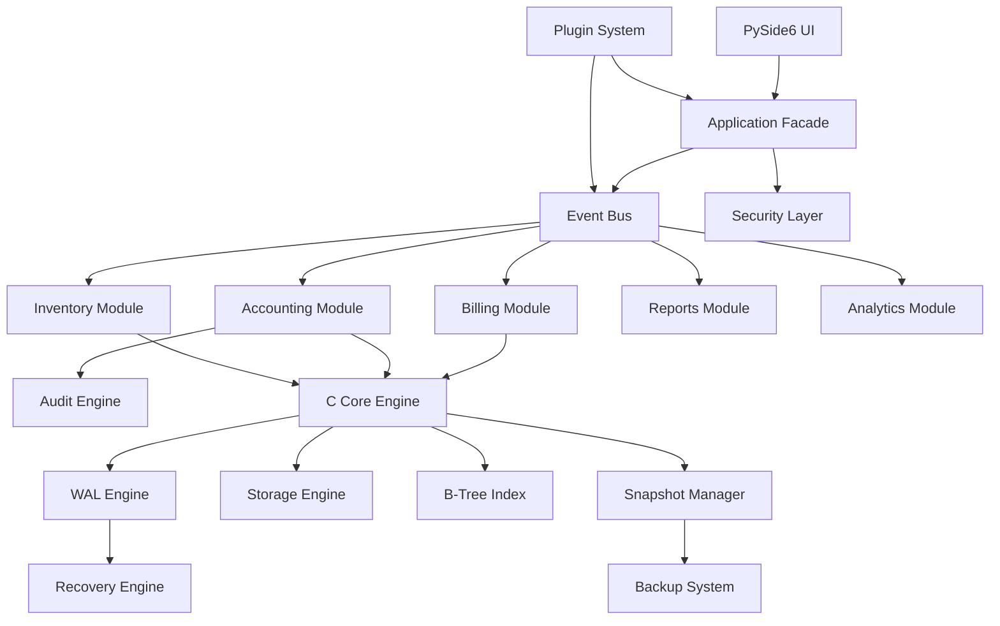

---

# 5. SYSTEM MODULE HLD

---

# 5.1 MODULE BOUNDARIES

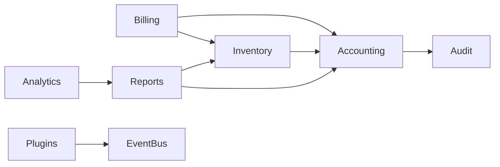

---

# 5.2 MODULE RULES

Modules must NEVER:
- access each other directly,
- bypass APIs,
- bypass event bus,
- mutate shared state unsafely.

---

# 6. CORE DIRECTORY ARCHITECTURE

---

# 6.1 COMPLETE CODEBASE STRUCTURE

```text
/project-root
¦
+-- /apps
¦   +-- desktop_app
¦
+-- /core
¦   +-- /storage
¦   +-- /events
¦   +-- /accounting
¦   +-- /inventory
¦   +-- /billing
¦   +-- /security
¦   +-- /audit
¦   +-- /plugins
¦   +-- /analytics
¦   +-- /reports
¦
+-- /native
¦   +-- /wal
¦   +-- /btree
¦   +-- /memory
¦   +-- /checksum
¦   +-- /simd
¦   +-- /storage
¦
+-- /plugins
+-- /tests
+-- /docs
+-- /scripts
+-- /configs
```

---

# 7. APPLICATION LAYER DESIGN

---

# 7.1 APP FACADE (HLD)

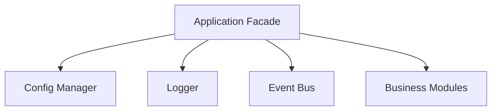

---

# 7.2 APP FACADE (LLD)

```python
class ApplicationFacade:
    def __init__(self):
        self.config = ConfigManager()
        self.logger = Logger()
        self.event_bus = EventBus()

        self.storage = StorageModule()
        self.billing = BillingModule()
        self.inventory = InventoryModule()
        self.accounting = AccountingModule()

    def start(self):
        self.storage.initialize()
        self.event_bus.start()
```

---

# 8. UI ARCHITECTURE

---

# 8.1 UI FLOW

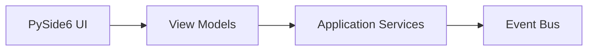

---

# 8.2 UI RULES

UI must NEVER:
- directly access storage,
- directly modify ledgers,
- contain business logic.

---

# 9. EVENT BUS ARCHITECTURE

---

# 9.1 EVENT SYSTEM HLD

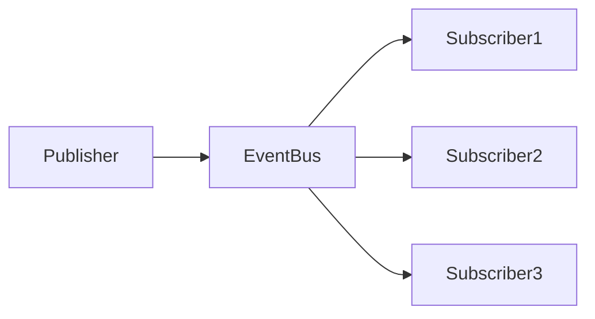

---

# 9.2 EVENT STRUCTURE (LLD)

```c
typedef struct {
    uint64_t id;
    uint32_t type;
    uint64_t timestamp;
    void* payload;
} Event;
```

---

# 9.3 EVENT BUS (LLD)

```python
class EventBus:

    def publish(self, event):
        pass

    def subscribe(self, event_type, handler):
        pass
```

---

# 10. BILLING MODULE

---

# 10.1 BILLING HLD

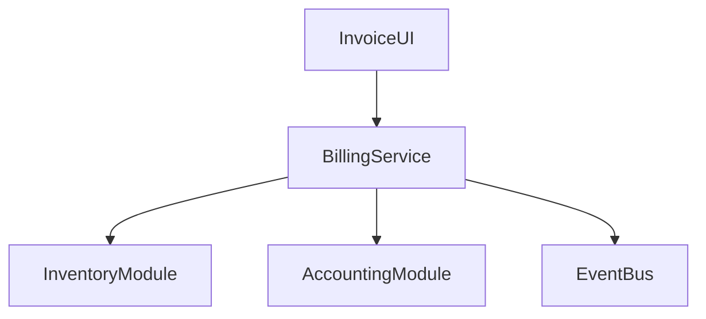

---

# 10.2 BILLING FLOW

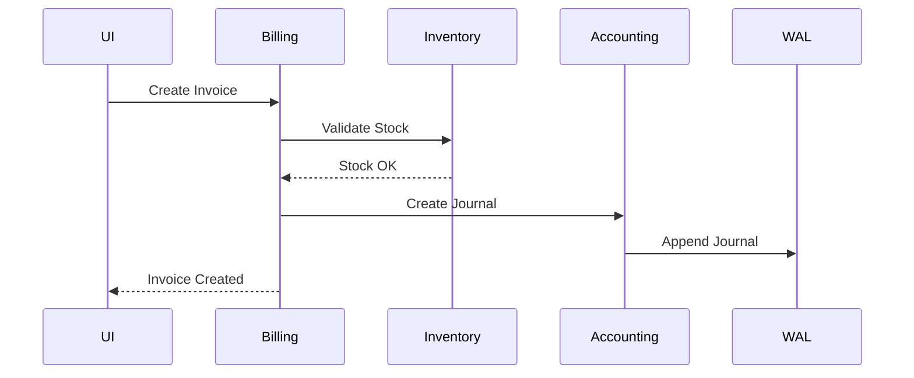

---

# 10.3 BILLING LLD

```python
class BillingService:

    def create_invoice(self, request):

        self.validate(request)

        self.inventory.reserve_stock(request)

        invoice = self.repository.save(request)

        self.accounting.create_sale_entry(invoice)

        self.events.publish(
            InvoiceCreated(invoice.id)
        )

        return invoice
```

---

# 11. ACCOUNTING MODULE

---

# 11.1 ACCOUNTING HLD

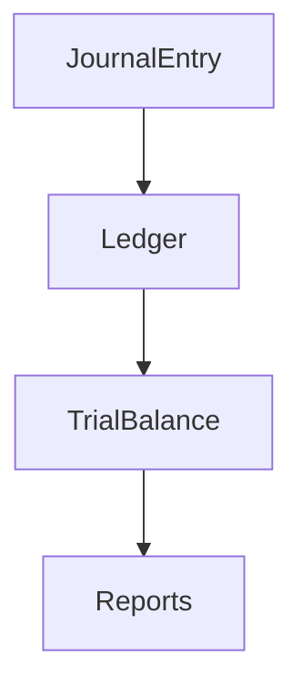

---

# 11.2 ACCOUNTING FLOW

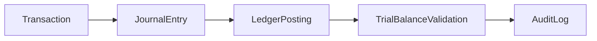

---

# 11.3 DOUBLE ENTRY VALIDATION

:contentReference[oaicite:0]{index=0}

---

# 11.4 ACCOUNTING LLD

```python
class JournalService:

    def post_entry(self, entry):

        debit_total = sum(x.debit for x in entry.lines)
        credit_total = sum(x.credit for x in entry.lines)

        if debit_total != credit_total:
            raise AccountingError()

        self.wal.append(entry)

        self.ledger.post(entry)
```

---

# 12. INVENTORY MODULE

---

# 12.1 INVENTORY HLD

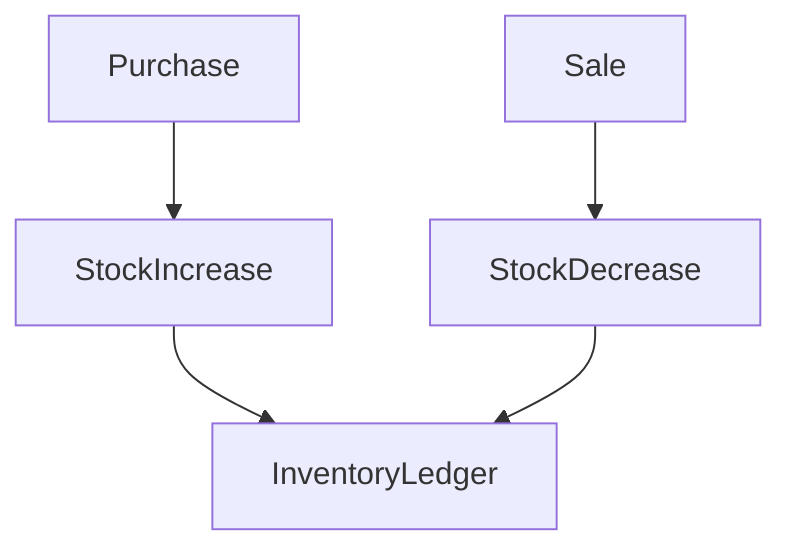

---

# 12.2 INVENTORY LLD

```python
class InventoryService:

    def deduct_stock(self, sku, qty):

        item = self.repo.get(sku)

        if item.stock < qty:
            raise InsufficientStock()

        item.stock -= qty

        self.repo.save(item)
```

---

# 13. STORAGE ENGINE ARCHITECTURE

---

# 13.1 STORAGE HLD

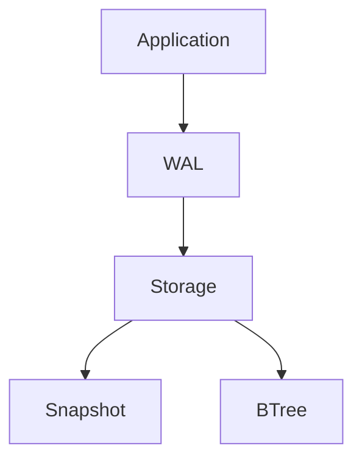

---

# 13.2 STORAGE FLOW

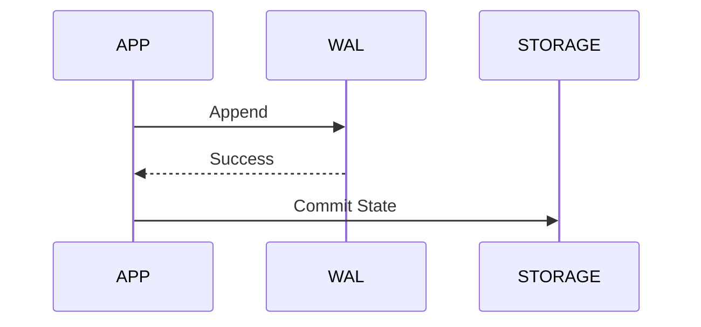

---

# 13.3 STORAGE LLD

```c
typedef struct {
    FILE* wal_file;
    FILE* data_file;
    BTree* indexes;
} StorageEngine;
```

---

# 14. WAL ENGINE

---

# 14.1 WAL HLD

```mermaid
flowchart LR

Transaction
    --> Serialize
    --> WAL Append
    --> Flush
    --> Commit
```

---

# 14.2 WAL RECORD STRUCTURE

```c
typedef struct {
    uint64_t lsn;
    uint32_t checksum;
    uint32_t payload_size;
    uint8_t payload[];
} WalRecord;
```

---

# 14.3 WAL APPEND (LLD)

```c
int wal_append(WalRecord* record)
{
    fwrite(record, sizeof(WalRecord), 1, wal_file);
    fflush(wal_file);

    return 0;
}
```

---

# 15. B-TREE STORAGE INDEX

---

# 15.1 B-TREE HLD

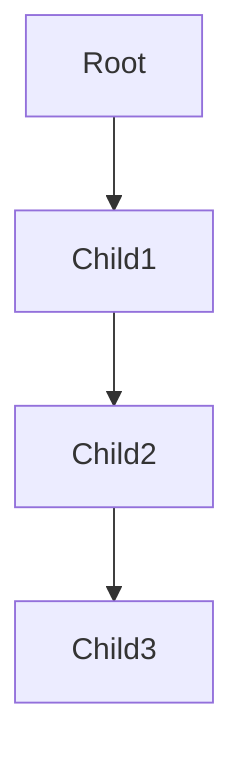

---

# 15.2 SEARCH COMPLEXITY

:contentReference[oaicite:1]{index=1}

---

# 15.3 B-TREE NODE

```c
typedef struct {
    int keys[MAX_KEYS];
    void* values[MAX_KEYS];
    struct BTreeNode* children[MAX_CHILDREN];
} BTreeNode;
```

---

# 16. PLUGIN SYSTEM

---

# 16.1 PLUGIN HLD

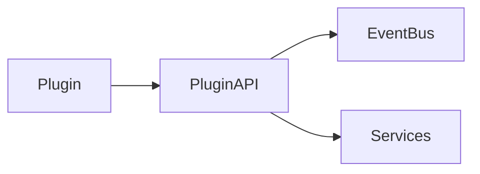

---

# 16.2 PLUGIN ABI

```c
typedef struct {
    uint32_t version;
    const char* name;

    int (*initialize)(void);
    int (*shutdown)(void);

} PluginABI;
```

---

# 16.3 PLUGIN RULES

Plugins must NEVER:
- access raw storage,
- bypass audit systems,
- mutate ledgers directly.

---

# 17. SECURITY ARCHITECTURE

---

# 17.1 SECURITY HLD

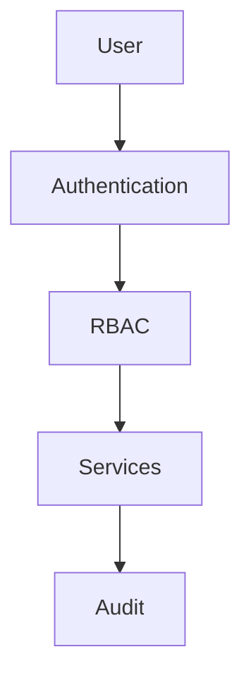

---

# 17.2 RBAC FLOW

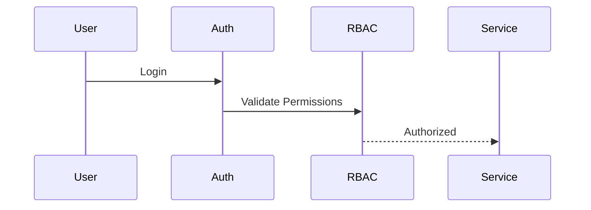

---

# 18. AUDIT SYSTEM

---

# 18.1 AUDIT FLOW

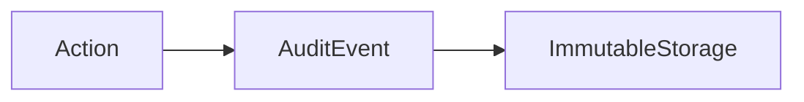

---

# 18.2 AUDIT EVENT STRUCTURE

```python
class AuditEvent:

    def __init__(
        self,
        actor,
        action,
        timestamp
    ):
        pass
```

---

# 19. BACKUP & RECOVERY

---

# 19.1 RECOVERY HLD

```mermaid
flowchart TD

Crash
    --> WAL Replay
    --> Snapshot Restore
    --> Validation
    --> Recovery Complete
```

---

# 19.2 RECOVERY FLOW

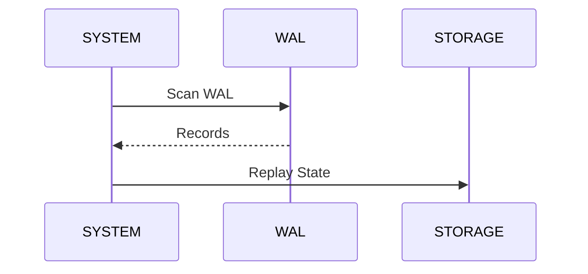

---

# 20. OBSERVABILITY ARCHITECTURE

---

# 20.1 OBSERVABILITY HLD

```mermaid
flowchart TD

Modules --> Logs
Modules --> Metrics
Modules --> Traces

Logs --> Dashboard
Metrics --> Dashboard
```

---

# 20.2 LOG STRUCTURE

```json
{
  "timestamp": "2026-05-12",
  "module": "billing",
  "event": "INVOICE_CREATED",
  "severity": "INFO"
}
```

---

# 21. MEMORY ARCHITECTURE

---

# 21.1 MEMORY STRATEGY

```mermaid
flowchart TD

Stack
 --> ArenaAllocator
 --> MemoryPool
 --> Heap
```

---

# 21.2 ARENA ALLOCATOR

```c
typedef struct {
    uint8_t* memory;
    size_t offset;
    size_t capacity;
} Arena;
```

---

# 22. THREADING MODEL

---

# 22.1 THREAD HLD

```mermaid
flowchart LR

UIThread
WorkerPool
StorageThread
LoggerThread
```

---

# 22.2 THREAD RULES

UI thread must NEVER:
- block on storage,
- perform heavy analytics,
- wait on network.

---

# 23. COMPLETE DATA FLOW

---

# 23.1 SALES FLOW

```mermaid
flowchart TD

UI
 --> Billing

Billing
 --> Inventory

Billing
 --> Accounting

Accounting
 --> WAL

WAL
 --> Storage

Accounting
 --> Audit

Inventory
 --> Reports
```

---

# 23.2 PURCHASE FLOW

```mermaid
flowchart TD

Purchase
 --> Inventory

Inventory
 --> Accounting

Accounting
 --> WAL

WAL
 --> Storage
```

---

# 24. DEPLOYMENT ARCHITECTURE

---

# 24.1 DEPLOYMENT HLD

```mermaid
flowchart TD

Installer
 --> AppRuntime

AppRuntime
 --> NativeDLL

NativeDLL
 --> DataDirectory
```

---

# 24.2 WINDOWS PACKAGE

```text
MSIX
Portable ZIP
Installer EXE
```

---

# 25. TESTING ARCHITECTURE

---

# 25.1 TESTING FLOW

```mermaid
flowchart LR

UnitTests
 --> IntegrationTests
 --> RecoveryTests
 --> E2ETests
```

---

# 25.2 TEST LAYERS

```text
pytest
CTest
ASAN
UBSAN
Valgrind
```

---

# 26. PERFORMANCE HOT PATHS

---

# 26.1 HOT PATHS

Optimize:
- WAL append
- inventory lookup
- event dispatch
- B-Tree search

---

# 26.2 PERFORMANCE FLOW

```mermaid
flowchart LR

Request
 --> Validation
 --> WAL
 --> Storage
 --> EventDispatch
```

---

# 27. FUTURE MICROSERVICE EXTRACTION

---

# 27.1 EXTRACTION PLAN

Future extraction candidates:
- analytics
- reports
- sync engine
- notification system

---

# 27.2 WHY EXTRACTION WILL WORK

Because architecture already uses:
- events
- module boundaries
- storage isolation
- service APIs

---

# 28. COMPLETE REQUEST LIFECYCLE

---

# 28.1 END-TO-END FLOW

```mermaid
sequenceDiagram

participant UI
participant API
participant BILLING
participant INVENTORY
participant ACCOUNTING
participant WAL
participant STORAGE
participant AUDIT

UI->>API: Create Invoice

API->>BILLING: Validate Request

BILLING->>INVENTORY: Reserve Stock

INVENTORY-->>BILLING: Success

BILLING->>ACCOUNTING: Create Journal

ACCOUNTING->>WAL: Append Transaction

WAL-->>ACCOUNTING: Success

ACCOUNTING->>STORAGE: Commit State

ACCOUNTING->>AUDIT: Generate Audit Event

ACCOUNTING-->>API: Success

API-->>UI: Invoice Created
```

---

# 29. FINAL ARCHITECTURAL PRINCIPLES

---

# 29.1 CORE PRINCIPLES

The system prioritizes:
- correctness
- reliability
- recoverability
- observability
- maintainability
- scalability

---

# 29.2 WHAT MAKES THIS INDUSTRY GRADE

This architecture includes:
- event-driven modularity
- WAL durability
- accounting correctness
- recovery engineering
- observability
- plugin isolation
- operational safety
- future scalability

---

# 30. FINAL PRINCIPAL ENGINEER CONCLUSION

This architecture establishes:

- a production-grade business platform,
- deterministic operational behavior,
- accounting-safe infrastructure,
- modular scalability,
- future microservice readiness,
- long-term maintainability.

Core architectural goals:
- correctness
- survivability
- operational simplicity
- financial integrity
- scalability
- engineering excellence

Ultimate Principle:

> Great architecture is not about complexity. It is about building systems that remain understandable, recoverable, financially correct, observable, maintainable, and scalable for years as the business and engineering organization grow.